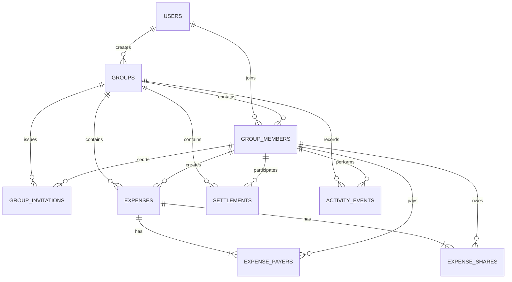

# Shared Expense Tracker: MVP Architecture and Schema

## Status

This document records the agreed product requirements and proposed data model for the first release. It is the baseline for implementation and can be updated through normal pull requests as requirements change.

## Product summary

The product is a private, general-purpose expense tracker for small groups. It records shared expenses, calculates group balances, and records settlements made outside the application.

The first release is intended as a personal project used by the account owner and invited users. It is not a payment processor and does not move money.

## Confirmed product decisions

- Every participant must have an application account; guest participants are not supported.
- The initial and only supported currency is Indian Rupees (`INR`).
- Money is stored as an integer number of paise.
- Any active group member can add an expense.
- An expense can be edited or deleted by its creator, a group administrator, or the group owner.
- A settlement can be recorded or changed by either settlement participant, a group administrator, or the group owner.
- The MVP supports equal and exact-amount splits.
- The MVP user interface supports one payer per expense.
- The database model supports multiple payers so that capability can be added later without migrating historical expenses.
- Balances and suggested settlements are calculated from expenses and settlements; they are not stored as mutable balances.
- Payments happen outside the application, for example through UPI, cash, or a bank transfer.

## MVP scope

### Accounts

- Sign in to an existing account or create an account.
- Maintain a display name, email address, and optional avatar.
- Require authentication before accepting a group invitation.

### Groups

- Create, rename, archive, and view a private group.
- Invite an account holder by email or with a time-limited link.
- Manage members with `owner`, `admin`, and `member` roles.
- Allow a member to leave while preserving all financial history.

### Expenses

- Record a description, amount, date, payer, participants, category, and optional notes.
- Split an expense equally or by exact amounts.
- Edit or soft-delete an expense according to the authorization policy.
- Display a chronological group expense list.
- Keep an audit record of material changes.

### Balances and settlements

- Display how much each member paid, owed, and should pay or receive.
- Generate simplified settlement suggestions from current net balances.
- Record full or partial external settlements.
- Support `UPI`, `cash`, `bank_transfer`, and `other` as settlement methods.
- Keep a settlement history and allow authorized corrections.

## Out of scope for the MVP

- Guest participants without accounts
- In-application money movement
- Bank account or UPI account aggregation
- Multiple currencies or currency conversion
- Multiple payers in the user interface
- Percentage- and share-based splits
- Receipt uploads
- Recurring expenses
- Offline editing and conflict resolution
- Native mobile applications
- Public groups

## Authorization policy

| Action | Active member | Expense creator | Settlement participant | Admin | Owner |
| --- | :---: | :---: | :---: | :---: | :---: |
| View group data | Yes | Yes | Yes | Yes | Yes |
| Add an expense | Yes | Yes | Yes | Yes | Yes |
| Edit/delete an expense created by someone else | No | N/A | No | Yes | Yes |
| Edit/delete own expense | N/A | Yes | N/A | Yes | Yes |
| Record/edit a settlement involving oneself | No | No | Yes | Yes | Yes |
| Record/edit a settlement between other members | No | No | No | Yes | Yes |
| Invite or remove members | No | No | No | Yes | Yes |
| Change member roles | No | No | No | No | Yes |
| Archive the group | No | No | No | No | Yes |

All authorization checks belong in the server-side application layer. Hiding an action in the user interface is not an authorization control.

## Recommended architecture

The MVP should be a modular monolith:

```text
Browser
   |
Next.js application
   |-- authentication and authorization
   |-- group module
   |-- expense module
   |-- settlement module
   |-- balance calculation
   `-- audit module
   |
Drizzle ORM
   |
SQLite
```

Recommended initial technologies:

- Next.js, React, and TypeScript
- Drizzle ORM and versioned SQL migrations
- SQLite through `better-sqlite3` for local development and a single Node.js server
- A server-managed authentication session
- Vitest for domain and database tests
- Playwright for important end-to-end flows

The application does not initially need microservices, Redis, a message broker, background workers, or a separately deployed API.

### SQLite deployment constraint

A hosted SQLite database must use persistent storage. The application should initially run as one Node.js application instance with one durable database file and regular backups. A local SQLite file must not be placed on an ephemeral serverless filesystem.

If a multi-instance or serverless deployment is required later, the choices are:

1. use a hosted SQLite-compatible service such as libSQL/Turso; or
2. migrate the relational schema to PostgreSQL.

The domain model should not depend on SQLite-specific business logic, keeping that migration manageable.

## Data-model principles

1. Store facts, not cached financial conclusions.
2. Store money in paise using an SQLite `INTEGER`; never use floating point for money.
3. Store every financial mutation in a database transaction.
4. Soft-delete financial records so historical activity remains explainable.
5. Preserve group members referenced by financial history even after they leave.
6. Store the final paise allocation for every participant, including equal splits.
7. Use application-generated text identifiers, such as UUIDs, for public entities.
8. Store timestamps in UTC and format them in `Asia/Kolkata` for the initial product.
9. Store calendar expense and settlement dates as `YYYY-MM-DD` values.
10. Use optimistic version numbers when editing expenses and settlements.

## Entity relationship diagram



Authentication adapters may add account, session, and verification tables. Those tables are owned by the selected authentication library and are separate from the expense domain.

## Proposed schema

The definitions below describe the logical schema. Exact SQL will be generated and reviewed as a Drizzle migration during implementation.

### `users`

Represents an application account. Every group participant must reference one user.

| Column | SQLite type | Rules |
| --- | --- | --- |
| `id` | `TEXT` | Primary key; application-generated |
| `email` | `TEXT` | Required; normalized; case-insensitive unique index |
| `display_name` | `TEXT` | Required |
| `avatar_url` | `TEXT` | Optional |
| `timezone` | `TEXT` | Required; default `Asia/Kolkata` |
| `created_at` | `TEXT` | Required UTC timestamp |
| `updated_at` | `TEXT` | Required UTC timestamp |
| `deleted_at` | `TEXT` | Optional UTC timestamp |

Account deletion should be implemented as deactivation and anonymization when financial history must be retained. Referenced financial history must not be silently removed.

### `groups`

Represents a private expense-sharing context such as a household, trip, or event.

| Column | SQLite type | Rules |
| --- | --- | --- |
| `id` | `TEXT` | Primary key |
| `name` | `TEXT` | Required |
| `description` | `TEXT` | Optional |
| `default_currency` | `TEXT` | Required; default `INR` |
| `created_by_user_id` | `TEXT` | Required foreign key to `users.id` |
| `simplify_debts` | `INTEGER` | Required boolean (`0` or `1`); default `1` |
| `created_at` | `TEXT` | Required UTC timestamp |
| `updated_at` | `TEXT` | Required UTC timestamp |
| `archived_at` | `TEXT` | Optional UTC timestamp |

Archiving excludes the group from the active group list but does not alter its balances or history.

### `group_members`

Associates an account with a group and provides the authorization role used within that group.

| Column | SQLite type | Rules |
| --- | --- | --- |
| `id` | `TEXT` | Primary key |
| `group_id` | `TEXT` | Required foreign key to `groups.id` |
| `user_id` | `TEXT` | Required foreign key to `users.id` |
| `role` | `TEXT` | Required; `owner`, `admin`, or `member` |
| `status` | `TEXT` | Required; `active` or `left` |
| `joined_at` | `TEXT` | Required UTC timestamp |
| `left_at` | `TEXT` | Optional UTC timestamp |
| `created_at` | `TEXT` | Required UTC timestamp |
| `updated_at` | `TEXT` | Required UTC timestamp |

Constraints and rules:

- Unique `(group_id, user_id)`.
- A user who rejoins reactivates the existing membership rather than creating another financial identity.
- A member referenced by an expense or settlement is never hard-deleted.
- Each group must have exactly one active owner. Ownership transfer is one transaction that promotes the new owner and changes the previous owner's role.

Expenses and settlements reference `group_members.id`, rather than `users.id`, because balances exist within a group.

### `group_invitations`

Represents a single-use invitation. The recipient must authenticate or create an account before accepting it.

| Column | SQLite type | Rules |
| --- | --- | --- |
| `id` | `TEXT` | Primary key |
| `group_id` | `TEXT` | Required foreign key to `groups.id` |
| `invited_by_member_id` | `TEXT` | Required foreign key to `group_members.id` |
| `invited_email` | `TEXT` | Optional for a general share link |
| `role` | `TEXT` | Required; `admin` or `member` |
| `token_hash` | `TEXT` | Required and unique; never store the raw token |
| `status` | `TEXT` | Required; `pending`, `accepted`, `revoked`, or `expired` |
| `expires_at` | `TEXT` | Required UTC timestamp |
| `accepted_by_user_id` | `TEXT` | Optional foreign key to `users.id` |
| `accepted_at` | `TEXT` | Optional UTC timestamp |
| `created_at` | `TEXT` | Required UTC timestamp |
| `updated_at` | `TEXT` | Required UTC timestamp |

Invitation acceptance must verify that the invitation is pending, has not expired, and is being accepted by the intended normalized email when `invited_email` is present.

### `expenses`

Stores the header and metadata for an expense.

| Column | SQLite type | Rules |
| --- | --- | --- |
| `id` | `TEXT` | Primary key |
| `group_id` | `TEXT` | Required foreign key to `groups.id` |
| `description` | `TEXT` | Required |
| `amount_paise` | `INTEGER` | Required; greater than zero |
| `currency` | `TEXT` | Required; `INR` for the MVP |
| `expense_date` | `TEXT` | Required `YYYY-MM-DD` date |
| `category` | `TEXT` | Optional application-defined category |
| `notes` | `TEXT` | Optional |
| `split_method` | `TEXT` | Required; `equal` or `exact` |
| `created_by_member_id` | `TEXT` | Required foreign key to `group_members.id` |
| `updated_by_member_id` | `TEXT` | Required foreign key to `group_members.id` |
| `version` | `INTEGER` | Required positive integer; starts at `1` |
| `created_at` | `TEXT` | Required UTC timestamp |
| `updated_at` | `TEXT` | Required UTC timestamp |
| `deleted_at` | `TEXT` | Optional UTC timestamp |
| `deleted_by_member_id` | `TEXT` | Optional foreign key to `group_members.id` |

Initial categories can be application constants: `food`, `travel`, `shopping`, `rent`, `utilities`, `entertainment`, and `other`. A category table is unnecessary until custom categories are supported.

### `expense_payers`

Stores how much each member paid toward an expense.

| Column | SQLite type | Rules |
| --- | --- | --- |
| `group_id` | `TEXT` | Required; intentionally repeated for group-boundary constraints |
| `expense_id` | `TEXT` | Required foreign key to `expenses.id` |
| `member_id` | `TEXT` | Required foreign key to `group_members.id` |
| `amount_paise` | `INTEGER` | Required; greater than zero |

Primary key: `(expense_id, member_id)`.

The MVP service creates exactly one payer row. The table permits multiple rows so multi-payer expenses can be introduced later.

`group_id` allows composite foreign keys to ensure both the expense and payer belong to the same group. The parent tables should expose unique `(group_id, id)` keys for this purpose.

### `expense_shares`

Stores each participant's final allocated share.

| Column | SQLite type | Rules |
| --- | --- | --- |
| `group_id` | `TEXT` | Required; intentionally repeated for group-boundary constraints |
| `expense_id` | `TEXT` | Required foreign key to `expenses.id` |
| `member_id` | `TEXT` | Required foreign key to `group_members.id` |
| `owed_paise` | `INTEGER` | Required; greater than zero |

Primary key: `(expense_id, member_id)`.

The final integer allocation is stored for both split methods. The application never recalculates a historical equal split merely to display or aggregate it.

For an equal split, divide the amount in paise and allocate any remainder deterministically. For example, `₹100.00` among three participants is stored as `₹33.34`, `₹33.33`, and `₹33.33`. The resulting shares must always sum to the expense amount.

### `settlements`

Records money paid outside the application from one group member to another.

| Column | SQLite type | Rules |
| --- | --- | --- |
| `id` | `TEXT` | Primary key |
| `group_id` | `TEXT` | Required foreign key to `groups.id` |
| `paid_by_member_id` | `TEXT` | Required foreign key to `group_members.id` |
| `received_by_member_id` | `TEXT` | Required foreign key to `group_members.id` |
| `amount_paise` | `INTEGER` | Required; greater than zero |
| `currency` | `TEXT` | Required; `INR` for the MVP |
| `settlement_date` | `TEXT` | Required `YYYY-MM-DD` date |
| `payment_method` | `TEXT` | Required; `upi`, `cash`, `bank_transfer`, or `other` |
| `notes` | `TEXT` | Optional; must not contain unnecessary bank credentials |
| `created_by_member_id` | `TEXT` | Required foreign key to `group_members.id` |
| `updated_by_member_id` | `TEXT` | Required foreign key to `group_members.id` |
| `version` | `INTEGER` | Required positive integer; starts at `1` |
| `created_at` | `TEXT` | Required UTC timestamp |
| `updated_at` | `TEXT` | Required UTC timestamp |
| `deleted_at` | `TEXT` | Optional UTC timestamp |
| `deleted_by_member_id` | `TEXT` | Optional foreign key to `group_members.id` |

Constraints and rules:

- `paid_by_member_id` and `received_by_member_id` must differ.
- Both participants and every acting member must belong to `group_id`.
- A settlement is group-level and is not allocated to individual expenses.
- The application may warn about an apparent overpayment, but the database may accept it because it can intentionally create a balance in the other direction.

### `activity_events`

Provides an append-only audit history for important user actions.

| Column | SQLite type | Rules |
| --- | --- | --- |
| `id` | `TEXT` | Primary key |
| `group_id` | `TEXT` | Required foreign key to `groups.id` |
| `actor_member_id` | `TEXT` | Optional only for a system action |
| `entity_type` | `TEXT` | Required; for example `expense`, `settlement`, `group`, or `member` |
| `entity_id` | `TEXT` | Required |
| `action` | `TEXT` | Required; for example `created`, `updated`, `deleted`, `restored`, or `joined` |
| `before_json` | `TEXT` | Optional valid JSON snapshot |
| `after_json` | `TEXT` | Optional valid JSON snapshot |
| `created_at` | `TEXT` | Required UTC timestamp |

An expense snapshot includes its header, payer rows, and share rows so an allocation change is auditable. Activity events are not edited or soft-deleted through ordinary product operations.

## Recommended indexes

In addition to primary keys and unique constraints:

```text
users(email normalized/case-insensitive) UNIQUE
group_members(group_id, user_id) UNIQUE
group_members(user_id, status)
group_members(group_id, status)
group_invitations(token_hash) UNIQUE
group_invitations(group_id, status, expires_at)
expenses(group_id, expense_date, created_at)
expense_payers(group_id, member_id)
expense_shares(group_id, member_id)
settlements(group_id, settlement_date, created_at)
settlements(group_id, paid_by_member_id)
settlements(group_id, received_by_member_id)
activity_events(group_id, created_at)
```

Queries must exclude rows whose `deleted_at` is non-null unless rendering audit or recovery views.

## Financial invariants

Every expense create or update operation must execute atomically and validate:

1. The expense amount is a positive integer number of paise.
2. There is at least one payer and one share.
3. All payers and participants are active members of the expense's group when the expense is created.
4. The payer amounts sum exactly to `expenses.amount_paise`.
5. The shares sum exactly to `expenses.amount_paise`.
6. The MVP request contains exactly one payer.
7. The currency is `INR` and matches the group currency.
8. The actor is authorized.
9. An update contains the expected current `version`.
10. The expense mutation and its activity event commit in one transaction.

SQLite `CHECK` constraints can validate row-level rules such as positive amounts, but they cannot validate aggregate payer and share sums. The expense service must enforce aggregate invariants inside the same database transaction and cover them with database integration tests.

Settlements follow equivalent membership, authorization, currency, version, audit, and transaction rules.

## Balance calculation

No `balances` or `debts` table is required for the MVP. For each active or historical member in a group:

```text
net balance =
    expense amounts paid
  - expense shares owed
  + settlements sent
  - settlements received
```

Interpretation:

- A positive balance means the member should receive money.
- A negative balance means the member owes money.
- A zero balance means the member is settled within the group.
- The sum of all member balances in a valid group must equal zero.

Deleted expenses and settlements do not contribute to balances.

Suggested transfers are generated from current net balances and are not persisted. A deterministic two-list algorithm can match debtors with creditors and produce at most a small set of practical transfers. Recording an actual settlement recalculates the suggestions naturally.

## Example

Anil pays `₹1,200.00` for Anil, Beena, and Charan:

```text
expenses.amount_paise = 120000

expense_payers
Anil   120000

expense_shares
Anil    40000
Beena   40000
Charan  40000
```

Expense contribution to balances:

```text
Anil    +80000 paise  (+₹800.00)
Beena   -40000 paise  (-₹400.00)
Charan  -40000 paise  (-₹400.00)
```

If Beena records a `₹400.00` settlement to Anil:

```text
Anil    +40000 paise  (+₹400.00)
Beena        0 paise
Charan  -40000 paise  (-₹400.00)
```

The group still sums to zero.

## SQLite operational settings

Enable these settings for every relevant database connection:

```sql
PRAGMA foreign_keys = ON;
PRAGMA journal_mode = WAL;
PRAGMA busy_timeout = 5000;
```

Additional recommendations:

- Prefer SQLite `STRICT` tables when supported by the chosen driver and migration tooling.
- Use explicit transactions for every multi-table mutation.
- Keep the database outside the web application's public directory.
- Restrict filesystem permissions for the database and backups.
- Use the SQLite online backup mechanism or a WAL-aware backup tool rather than copying a live database file carelessly.
- Test database restoration, not only backup creation.

## Initial implementation sequence

1. Implement and test the relational model as raw, versioned SQLite migrations.
2. Exercise constraints, balance views, transaction boundaries, and query plans with representative SQL data.
3. Establish the Next.js and TypeScript application and map the reviewed schema with Drizzle.
4. Add authentication-owned tables and the `users` integration.
5. Implement groups, memberships, invitations, and server-side authorization.
6. Implement transactional expense creation with equal and exact splits.
7. Implement edits, soft deletion, optimistic concurrency, and activity events.
8. Implement settlements and deterministic suggested transfers.
9. Add responsive group, expense, and balance interfaces.
10. Add persistent deployment, backup, restoration, observability, and scale-evolution documentation.

## Acceptance criteria for the schema layer

- Foreign-key enforcement is enabled and covered by a test.
- Cross-group payer, share, and settlement references are rejected.
- An unbalanced expense cannot be committed through the application service.
- Equal-split rounding always produces integer paise that sum to the total.
- Editing an expense changes all related rows atomically and increments its version.
- Deleted financial records stop affecting balances but remain represented in the audit history.
- Unauthorized edits and settlements are rejected by server-side tests.
- Every valid group's calculated balances sum to zero.
- A member who leaves a group remains visible in historical expenses and balance calculations.
- Invitation acceptance requires an authenticated account and cannot create duplicate membership.
nt and cannot create duplicate membership.
es a group remains visible in historical expenses and balance calculations.
- Invitation acceptance requires an authenticated account and cannot create duplicate membership.
